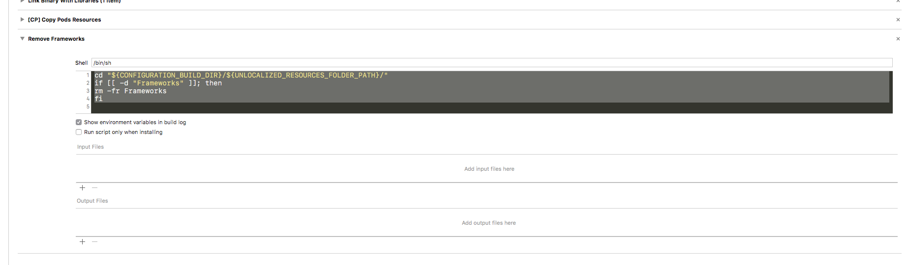

  ```
    bundle install
    export GIT_REPO="ssh://git@xxxx.at/mobile/IOS-CERTIFICATES.git"
    bundle exec fastlane do_local_test
  ```
  
  
  
  add the following script / run phase to all appex targets:
  
  ```
  cd "${CONFIGURATION_BUILD_DIR}/${UNLOCALIZED_RESOURCES_FOLDER_PATH}/"
  if [[ -d "Frameworks" ]]; then
    rm -fr Frameworks
  fi
```

